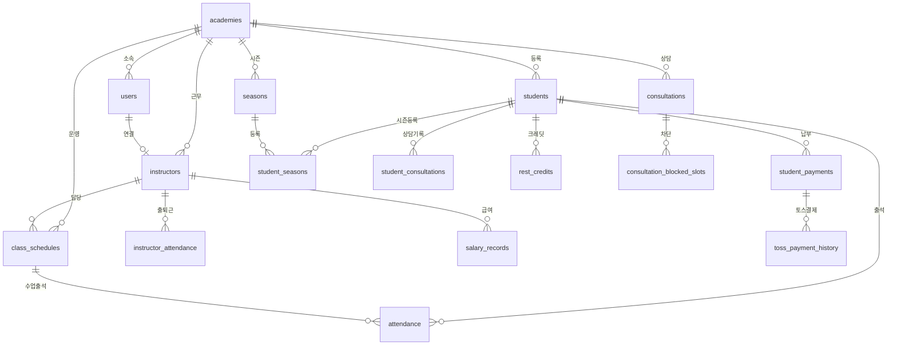
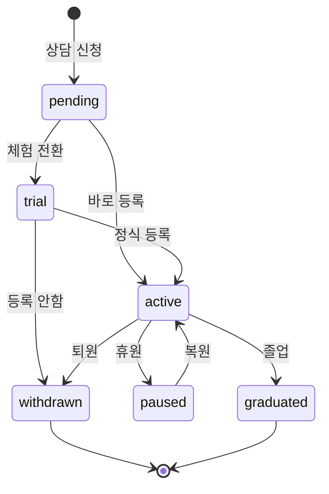
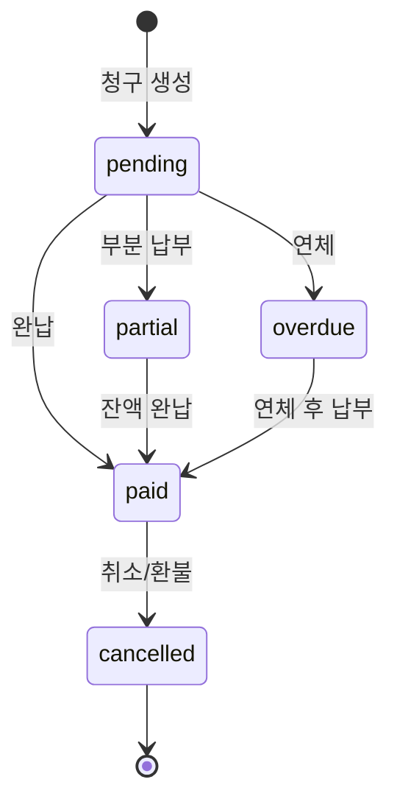
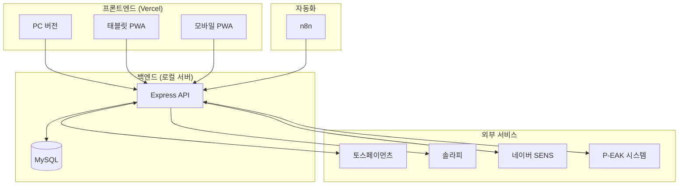

# P-ACA 시스템 아키텍처 문서

> **최종 업데이트**: 2026-02-11
> **버전**: v3.8.8

---

## 1. 시스템 개요

P-ACA는 **체육입시 학원관리 시스템**으로, 학생/강사/수업/결제/상담을 통합 관리합니다.

### 1.1 시스템 구성

```
┌─────────────────────────────────────────────────────────────────┐
│                        사용자 디바이스                            │
├──────────────┬──────────────┬──────────────┬───────────────────┤
│   PC 브라우저  │   태블릿 PWA  │   모바일 PWA  │   공개 페이지      │
│   (관리자)     │   (현장 운영)  │   (빠른 접근)  │   (상담 신청)      │
└──────┬───────┴──────┬───────┴──────┬───────┴─────────┬─────────┘
       │              │              │                  │
       ▼              ▼              ▼                  ▼
┌─────────────────────────────────────────────────────────────────┐
│                    프론트엔드 (Next.js 15)                        │
│                    Vercel 호스팅 (paca.chejump.com)               │
└─────────────────────────────┬───────────────────────────────────┘
                              │ HTTPS API 호출
                              ▼
┌─────────────────────────────────────────────────────────────────┐
│                    백엔드 (Express.js)                           │
│                    로컬 서버 (chejump.com:8320)                   │
│                    systemd 서비스 관리                            │
└─────────────────────────────┬───────────────────────────────────┘
                              │
          ┌───────────────────┼───────────────────┐
          ▼                   ▼                   ▼
┌─────────────────┐ ┌─────────────────┐ ┌─────────────────────────┐
│    MySQL DB     │ │    n8n 자동화    │ │    외부 서비스           │
│    (학원 데이터) │ │    (알림 발송)   │ │  - 토스 결제             │
└─────────────────┘ └─────────────────┘ │  - 솔라피/SENS 알림톡    │
                                        │  - Web Push             │
                                        └─────────────────────────┘
```

### 1.2 기술 스택

| 레이어 | 기술 |
|--------|------|
| **프론트엔드** | Next.js 15, React, TypeScript, Tailwind CSS, shadcn/ui |
| **백엔드** | Express.js, Node.js |
| **데이터베이스** | MySQL (mysql2 드라이버) |
| **호스팅** | Vercel (프론트), 로컬 서버 (백엔드), Caddy (리버스 프록시) |
| **자동화** | n8n (Docker) |
| **결제** | 토스페이먼츠 |
| **알림** | 솔라피, 네이버 클라우드 SENS |

---

## 2. 프론트엔드 아키텍처

### 2.1 디렉토리 구조

```
src/
├── app/                    # Next.js App Router
│   ├── (인증 페이지)
│   │   ├── login/         # 로그인
│   │   ├── register/      # 회원가입
│   │   ├── forgot-password/
│   │   └── reset-password/
│   │
│   ├── (메인 기능 - PC)
│   │   ├── students/      # 학생 관리 + class-days (요일반)
│   │   ├── instructors/   # 강사 관리
│   │   ├── schedules/     # 수업 스케줄
│   │   ├── payments/      # 학원비 + credits, toss
│   │   ├── salaries/      # 급여
│   │   ├── consultations/ # 상담 + calendar, enrolled, settings, new-inquiry
│   │   ├── seasons/       # 시즌
│   │   ├── academy-events/# 학원 일정
│   │   ├── settings/      # 설정 + notifications
│   │   └── ...
│   │
│   ├── tablet/            # 태블릿 전용
│   │   ├── attendance/    # 출석 체크
│   │   ├── students/      # 학생 조회
│   │   ├── payments/      # 결제 확인
│   │   ├── consultations/ # 상담
│   │   ├── sms/           # 문자
│   │   └── settings/
│   │
│   ├── m/                 # 모바일 전용
│   │   ├── attendance/    # 출석
│   │   ├── instructor/    # 강사 체크인
│   │   ├── unpaid/        # 미납자
│   │   └── consultations/ # 오늘 상담
│   │
│   ├── c/[slug]/          # 공개 상담 신청
│   └── consultation/      # 예약 확인
│
├── components/            # 컴포넌트
│   ├── layout/           # 레이아웃 (Sidebar, TopNav)
│   ├── ui/               # shadcn/ui 컴포넌트
│   ├── students/         # 학생 관련
│   ├── instructors/      # 강사 관련
│   ├── schedules/        # 수업 관련
│   ├── payments/         # 결제 관련
│   └── ...
│
├── lib/
│   ├── api/              # API 클라이언트 (19개 모듈 + client.ts)
│   └── types/            # TypeScript 타입 정의 (10개)
│
└── middleware.ts         # 태블릿 자동 리다이렉트
```

### 2.2 페이지 라우팅 구조

```
라우트 계층도
├── / (대시보드)
│
├── 학원 운영
│   ├── /students (학생 목록)
│   │   ├── /new (등록)
│   │   ├── /class-days (요일반 관리)
│   │   └── /[id] (상세) → /edit (수정)
│   │
│   ├── /instructors (강사)
│   │   ├── /new
│   │   └── /[id] → /edit
│   │
│   ├── /schedules (수업)
│   │   ├── /new
│   │   └── /[id] → /attendance, /edit
│   │
│   ├── /seasons (시즌)
│   │   ├── /new
│   │   └── /[id] → /enroll, /edit
│   │
│   ├── /academy-events (학원 일정)
│   └── /performance (성적)
│
├── 재무 관리
│   ├── /payments (학원비)
│   │   ├── /new (등록)
│   │   ├── /credits (크레딧 관리)
│   │   ├── /toss (토스 결제 관리)
│   │   └── /[id] → /edit
│   ├── /salaries (급여) → /[id] (상세)
│   ├── /expenses (지출)
│   └── /incomes (수입)
│
├── 상담
│   ├── /consultations (신규 상담)
│   │   ├── /calendar (캘린더)
│   │   ├── /enrolled (재원생 상담)
│   │   ├── /new-inquiry (직접 상담 등록)
│   │   ├── /settings (상담 설정)
│   │   └── /[id]/conduct (상담 진행)
│   └── /sms (문자 발송)
│
├── 설정
│   ├── /settings
│   │   └── /notifications (알림 설정)
│   ├── /staff (직원 관리)
│   ├── /admin/users (사용자 관리)
│   └── /reports (보고서)
│
├── 태블릿 (/tablet/*)
│   ├── /attendance (출석 체크)
│   ├── /students → /[id] (학생 조회/상세)
│   ├── /payments (결제 확인)
│   ├── /consultations → /[id]/conduct (상담)
│   ├── /sms (문자)
│   ├── /schedule (수업)
│   └── /settings
│
├── 모바일 (/m/*)
│   ├── / (메인)
│   ├── /attendance (출석)
│   ├── /instructor (강사 체크인)
│   ├── /unpaid (미납자)
│   └── /consultations (오늘 상담)
│
└── 공개 페이지
    ├── /c/[slug] (상담 신청) → /success (완료)
    └── /consultation/[reservationNumber] (예약 확인)
```

### 2.3 컴포넌트 구조

```
컴포넌트 계층
├── LayoutWrapper (전체 레이아웃 관리)
│   ├── Sidebar (좌측 네비게이션)
│   │   ├── 학원 운영 메뉴
│   │   ├── 재무 관리 메뉴
│   │   └── 커뮤니케이션 메뉴
│   │
│   └── TopNav (상단 바)
│       ├── 검색
│       ├── 사용자 메뉴
│       └── 테마 토글
│
├── 기능별 컴포넌트 (91개)
│   ├── students/ (16개)
│   │   ├── StudentForm, StudentListTable, StudentCard
│   │   ├── StudentPayments, StudentSeasons, StudentPerformance
│   │   ├── StudentConsultations, StudentSearch, StudentFilters
│   │   ├── StudentRestModal, StudentResumeModal, ManualCreditModal
│   │   ├── TrialStudentList, PendingStudentList
│   │   └── SchoolStudentList, StudentStatsCards
│   │
│   ├── schedules/ (14개)
│   │   ├── ScheduleForm, ScheduleCalendar, ScheduleCalendarV2
│   │   ├── ScheduleCard, ScheduleList, ScheduleFilters
│   │   ├── AttendanceChecker, InstructorAttendanceChecker
│   │   ├── InstructorSchedulePanel, InstructorScheduleModal
│   │   ├── InstructorAttendanceModal, TimeSlotDetailModal
│   │   └── PendingApprovalsModal, ExtraDayRequestModal
│   │
│   ├── payments/ (5개) - PaymentForm, PaymentList, PaymentCard, PaymentRecordModal, PrepaidPaymentModal
│   ├── instructors/ (8개) - Form, List, Card, Search, Filters, StatsCards, Attendance, Salaries
│   ├── attendance/ (8개) - StatsDashboard, SwipeableCard, RadialMenu, SearchFilter, ReasonBottomSheet, Confetti, QuickActionsToolbar, AttendanceCard
│   ├── salaries/ (2개) - SalaryCalculator, SalaryList
│   ├── staff/ (3개) - StaffList, PermissionModal, StaffFormModal
│   ├── academy-events/ (2개) - EventCalendar, EventFormModal
│   ├── dashboard/ (2개) - DashboardSkeleton, StatsCard
│   ├── expenses/ (1개) - ExpenseCalendar
│   ├── incomes/ (1개) - IncomeCalendar
│   ├── refund/ (1개) - RefundModal
│   └── 공통 (8개) - VersionChecker, Providers, ThemeToggle, PWAInstallPrompt, PushNotificationSettings, DynamicManifest, DynamicTitle, PasswordConfirmModal
│
├── 레이아웃 (5개)
│   ├── LayoutWrapper, Sidebar, TopNav
│   └── SidebarTooltip, CollapsedCategoryMenu
│
└── UI 컴포넌트 (shadcn/ui 14개)
    ├── Button, Card, Input, Select, Textarea, Label
    ├── Dialog, AlertDialog, DropdownMenu
    ├── Badge, Tabs, Checkbox, Switch, Skeleton
    └── ...
```

---

## 3. 백엔드 API 구조

### 3.1 API 카테고리 (250+ 엔드포인트)

```
API 엔드포인트 구조
├── /api/auth (인증)
│   ├── POST /login
│   ├── POST /register
│   ├── GET /me
│   └── POST /change-password
│
├── /api/students (학생)
│   ├── GET / (목록)
│   ├── POST / (등록)
│   ├── GET /:id (상세)
│   ├── PUT /:id (수정)
│   ├── DELETE /:id (삭제)
│   ├── POST /:id/withdraw (퇴원)
│   ├── POST /:id/process-rest, /resume (휴원)
│   ├── 요일반: GET /class-days, PUT /class-days/bulk
│   └── 크레딧: GET /:id/credits, POST /:id/manual-credit
│
├── /api/instructors (강사)
│   ├── CRUD
│   ├── POST /:id/attendance (출퇴근)
│   └── 초과근무 승인
│
├── /api/schedules (수업)
│   ├── CRUD
│   ├── GET /:id/attendance (출석)
│   ├── POST /:id/attendance (출석 체크)
│   └── 강사 배정
│
├── /api/payments (학원비)
│   ├── CRUD
│   ├── POST /:id/pay (납부)
│   ├── GET /unpaid (미납)
│   ├── GET /credits, /credits/summary (크레딧)
│   └── POST /prepaid-preview, /prepaid-pay (선납 할인)
│
├── /api/salaries (급여)
│   ├── GET /work-summary
│   ├── POST /calculate
│   └── POST /bulk-pay
│
├── /api/consultations (상담)
│   ├── 관리자 CRUD
│   ├── 설정 (운영시간, 차단)
│   └── 캘린더 이벤트
│
├── /api/seasons (시즌)
│   ├── CRUD
│   ├── POST /:id/enroll (등록)
│   └── 환불 처리
│
├── /api/notifications (알림톡)
│   ├── 솔라피/SENS 설정
│   ├── 테스트/발송
│   └── 리마인더 자동 발송
│
├── /api/sms (문자)
│   ├── POST /send
│   └── 발신번호 관리
│
├── /api/toss (토스 결제)
│   ├── 콜백 처리
│   └── 매칭 관리
│
├── /api/public (공개 - 인증 불필요)
│   ├── GET /consultation/:slug
│   ├── GET /consultation/:slug/slots
│   └── POST /consultation/:slug/apply
│
├── /api/academy-events (학원 일정)
│   └── CRUD + 휴일 자동 휴강 처리
│
├── /api/student-consultations (재원생 상담)
│   ├── GET /calendar
│   └── 학생별 상담 CRUD
│
└── /api/exports (엑셀 다운로드)
    ├── GET /payments, /salaries, /students
    └── GET /revenue, /expenses, /financial
```

### 3.2 인증 & 권한

```
권한 시스템
├── 역할 (role)
│   ├── owner (원장) - 모든 권한
│   ├── admin (관리자)
│   ├── teacher (강사)
│   └── staff (직원)
│
└── 페이지별 권한 (permissions)
    ├── students.view / students.edit
    ├── instructors.view / instructors.edit
    ├── schedules.view / schedules.edit
    ├── payments.view / payments.edit
    ├── salaries.view / salaries.edit
    ├── seasons.view / seasons.edit
    ├── consultations.view / consultations.edit
    ├── reports.view
    ├── settings.view / settings.edit
    ├── expenses.view / expenses.edit
    ├── incomes.view / incomes.edit
    ├── overtime_approval.view / overtime_approval.edit
    ├── notifications.view / notifications.edit
    ├── sms.view / sms.edit
    └── class_days.view / class_days.edit
```

---

## 4. 데이터베이스 스키마

### 4.1 테이블 목록 (43개, NocoDB 제외)

```
DB 테이블 구조
├── 핵심 (Core)
│   ├── academies (학원)
│   ├── users (사용자)
│   ├── students (학생) ⭐ 암호화
│   └── instructors (강사) ⭐ 암호화
│
├── 수업 관리
│   ├── class_schedules (수업 일정)
│   ├── attendance (출석)
│   ├── instructor_schedules (강사 배정)
│   └── instructor_attendance (강사 출퇴근)
│
├── 결제/재무
│   ├── student_payments (학원비)
│   ├── toss_payment_history (토스 결제)
│   ├── toss_payment_queue (토스 대기열)
│   ├── expenses (지출)
│   ├── other_incomes (기타 수입)
│   ├── salary_records (급여)
│   └── rest_credits (휴원 크레딧)
│
├── 상담
│   ├── consultations (상담 예약)
│   ├── student_consultations (재원생 상담)
│   ├── consultation_settings (설정)
│   ├── consultation_weekly_hours (운영시간)
│   └── consultation_blocked_slots (차단)
│
├── 시즌
│   ├── seasons (시즌)
│   ├── student_seasons (학생 시즌 등록)
│   └── season_settings (시즌 설정)
│
├── 알림
│   ├── notification_settings (알림 설정)
│   ├── notification_logs (발송 로그)
│   ├── push_subscriptions (푸시 구독)
│   ├── user_notification_settings (사용자 설정)
│   └── sender_numbers (발신번호)
│
└── 기타
    ├── academy_events (학원 일정)
    ├── academy_settings (학원 설정)
    ├── audit_logs (감사 로그)
    ├── classes (반)
    ├── student_classes (학생-반)
    ├── student_performance (성적)
    ├── holidays (공휴일)
    ├── overtime_approvals (초과근무)
    ├── toss_settings (토스 설정)
    ├── revenues (매출)
    └── test_applicants (시험 응시자)

※ paca DB에 NocoDB 테이블(nc_*, xc_*)이 ~67개 포함되어 있으나 앱과 무관
```

### 4.2 주요 테이블 관계도 (Mermaid)



### 4.3 학생 상태 흐름



### 4.4 결제 상태 흐름



---

## 5. 주요 기능 상세

### 5.1 학생 관리

```
학생 생명주기
├── 상담 신청 (공개 페이지)
│   └── /c/{학원slug} → consultations 테이블
│
├── 체험 전환
│   └── consultation → trial 학생 (체험 횟수 설정)
│
├── 정식 등록
│   ├── 기본 정보 (이름, 연락처, 학교, 학년)
│   ├── 수업 설정 (요일, 시간대, 주 횟수)
│   ├── 학원비 설정 (자동 계산 or 수동)
│   └── 시즌 등록 (옵션)
│
├── 재원 중
│   ├── 출석 관리
│   ├── 학원비 납부
│   ├── 상담 기록
│   └── 성적/실기 기록
│
├── 휴원
│   ├── 휴원 기간 설정
│   ├── 크레딧 발생 (공결 처리)
│   └── 자동 복원 알림
│
└── 퇴원/졸업
    ├── 퇴원 사유 기록
    └── 데이터 보존 (soft delete)
```

### 5.2 수업 스케줄

```
수업 운영 흐름
├── 수업 생성
│   ├── 날짜, 시간대 (오전/오후/저녁)
│   └── 강사 배정
│
├── 학생 배정
│   ├── 학생 등록 시 자동 배정
│   └── 타임슬롯 이동 가능
│
├── 출석 체크
│   ├── 출석 (present)
│   ├── 결석 (absent)
│   ├── 지각 (late)
│   └── 공결 (excused) → 크레딧 발생
│
└── 휴강 처리
    └── 학원 일정에서 휴일 설정 시 자동 휴강
```

### 5.3 학원비 관리

```
학원비 흐름
├── 청구 생성
│   ├── 월별 일괄 생성
│   ├── 일할 계산 (월 중 등록)
│   └── 시즌비 청구
│
├── 금액 계산
│   ├── 기본 금액 (주 횟수별 요금표)
│   ├── 할인 적용 (비율 or 금액)
│   ├── 크레딧 차감
│   └── 최종 금액
│
├── 납부 처리
│   ├── 현금/카드/이체
│   ├── 토스 결제 (플러그인 연동)
│   └── 부분 납부 가능
│
└── 미납 관리
    ├── 미납자 목록
    ├── 알림톡 자동 발송 (n8n)
    └── 수업일 미납자 알림
```

### 5.4 시즌 관리

```
시즌 흐름 (수시/정시)
├── 시즌 생성
│   ├── 시즌명, 타입 (수시/정시)
│   ├── 기간 설정
│   └── 기본 시즌비
│
├── 학생 등록
│   ├── 개별 등록
│   ├── 일할 계산 미리보기
│   └── 시즌비 청구 자동 생성
│
├── 운영
│   ├── 등록 학생 관리
│   └── 출석/성적 연동
│
└── 환불 처리
    ├── 환불 미리보기 (학원법 기준)
    ├── 일할 계산
    └── 크레딧 or 현금 환불
```

### 5.5 상담 관리

```
상담 흐름
├── 공개 상담 신청
│   ├── /c/{slug} 페이지
│   ├── 학생 정보 입력
│   ├── 성적 정보 (내신, 모의고사)
│   └── 희망 일시 선택
│
├── 관리자 확인
│   ├── 상담 목록 확인
│   ├── 상담 확정 → 알림톡 발송
│   └── 일정 변경/취소
│
├── 상담 진행
│   ├── 상담 기록 작성
│   ├── 목표 대학 설정
│   └── 실기 기록 연동 (P-EAK)
│
└── 전환
    ├── 체험생 전환
    ├── 미등록 관리 전환
    └── 바로 등록
```

---

## 6. 외부 시스템 연동

### 6.1 연동 구조



### 6.2 토스 결제

```
토스 결제 흐름
1. 학원 → 토스 플러그인에 결제 정보 전송
2. 학부모 → 토스앱에서 결제
3. 토스 → P-ACA 콜백 호출
4. P-ACA → 결제 매칭 (자동 or 수동)
5. 학원비 상태 업데이트
```

### 6.3 알림톡 (솔라피/SENS)

```
알림톡 종류 (솔라피 + SENS 이중 지원)
├── 상담 확정 알림
├── 체험 수업 안내
├── 미납 안내
├── 상담 리마인더 (D-1)
├── 휴원 종료 안내
└── 리마인더 자동 발송
```

### 6.4 n8n 자동화

```
n8n 워크플로우
├── 매일 09:00 - 오늘 수업 미납자 알림톡 (솔라피/SENS)
├── 매일 09:00 - 오늘 체험 학생 알림톡 (솔라피/SENS)
├── 상담 D-1 리마인더 (솔라피/SENS)
└── 휴원 종료 예정 알림
```

---

## 7. 보안

### 7.1 암호화 필드

```
암호화 대상 (AES-256)
├── students
│   ├── name
│   ├── phone
│   └── parent_phone
│
└── instructors
    ├── name
    ├── phone
    ├── resident_number (주민번호)
    └── account_number (계좌번호)

⚠️ SQL LIKE 검색 불가 → 메모리 필터링 필요
```

### 7.2 인증

```
인증 방식
├── JWT Bearer Token
├── localStorage 저장
├── 자동 갱신 없음 (만료 시 재로그인)
└── 역할 기반 접근 제어 (RBAC)
```

---

## 8. 배포 & 운영

### 8.1 배포 구조

```
배포 파이프라인
├── 프론트엔드
│   └── git push → Vercel 자동 배포
│
└── 백엔드
    └── sudo systemctl restart paca
```

### 8.2 환경 설정

| 항목 | 값 |
|------|-----|
| 프론트 URL | paca.chejump.com |
| API URL | chejump.com:8320 |
| DB | MySQL (로컬) |
| 프로세스 관리 | systemd |
| 리버스 프록시 | Caddy |

---

## 9. 버전 관리

버전 업데이트 시 수정 위치:
1. `package.json` → version
2. `src/components/version-checker.tsx` → APP_VERSION
3. `src/components/layout/sidebar.tsx` → P-ACA vX.X.X
4. `src/app/settings/page.tsx` → vX.X.X
5. `src/app/tablet/layout.tsx` → APP_VERSION

---

## 10. 통계

| 항목 | 수치 |
|------|------|
| 프론트엔드 페이지 | 67개 |
| 컴포넌트 | 91개 |
| API 엔드포인트 | 250+ |
| DB 테이블 | 43개 (NocoDB 제외) |
| 백엔드 라우트 모듈 | 27개 |
| 프론트 API 모듈 | 19개 |
| TypeScript 타입 | 10개 |

---

## 부록: 주요 ENUM 값

### 학생 상태 (students.status)
- `active` - 재원생
- `paused` - 휴원
- `withdrawn` - 퇴원
- `graduated` - 졸업
- `trial` - 체험
- `pending` - 미등록

### 시간대 (time_slot)
- `morning` - 오전
- `afternoon` - 오후
- `evening` - 저녁

### 출석 상태 (attendance_status)
- `present` - 출석
- `absent` - 결석
- `late` - 지각
- `excused` - 공결

### 결제 상태 (payment_status)
- `pending` - 대기
- `paid` - 완납
- `partial` - 부분납부
- `overdue` - 연체
- `cancelled` - 취소

### 시즌 타입 (season_type)
- `early` - 수시
- `regular` - 정시
